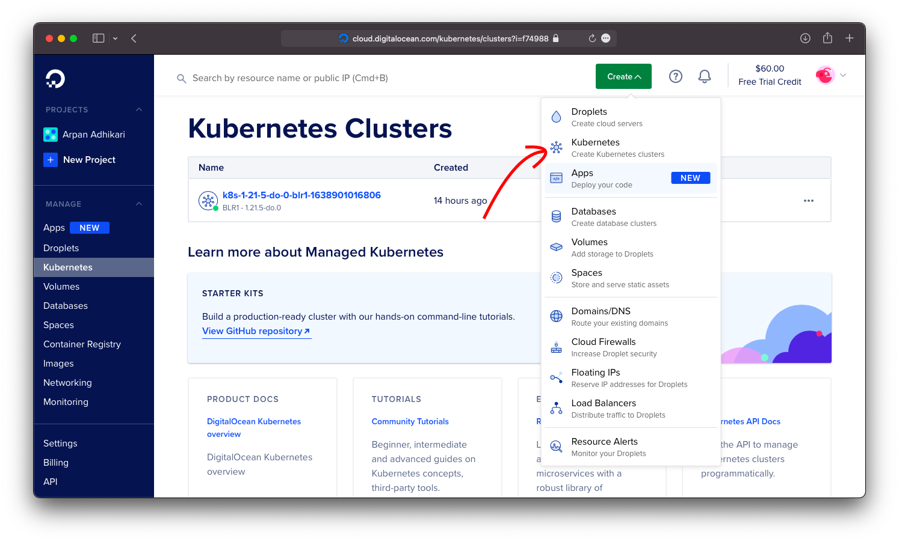
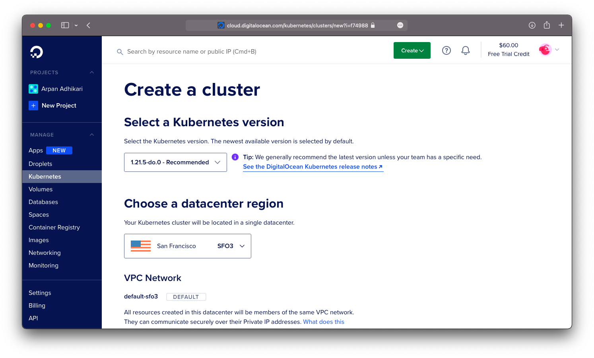
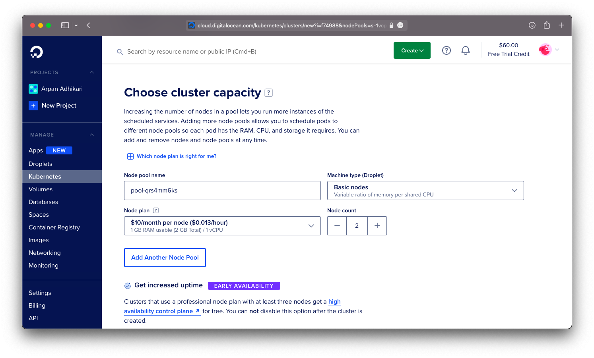
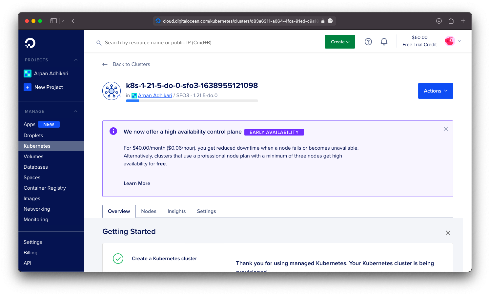
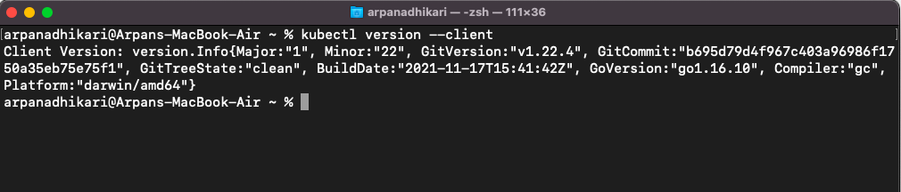
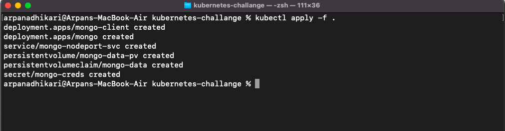
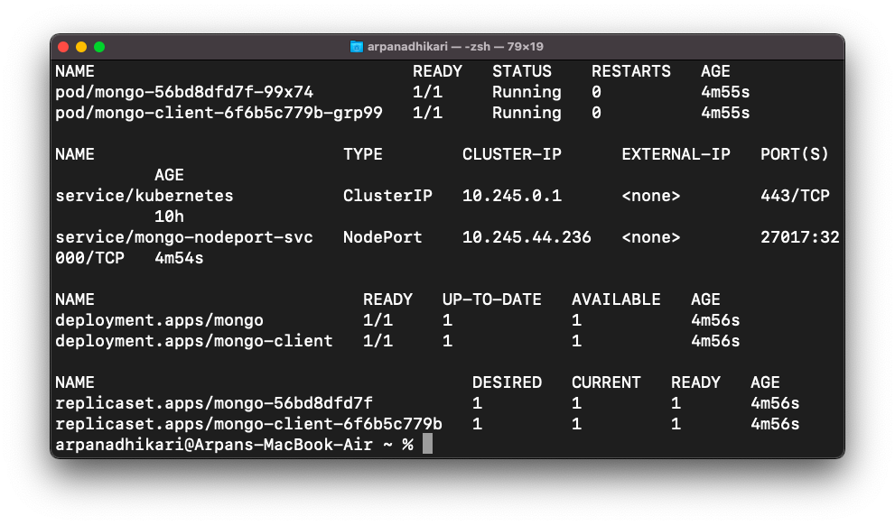
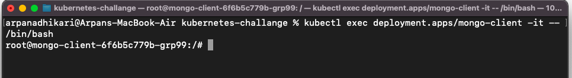
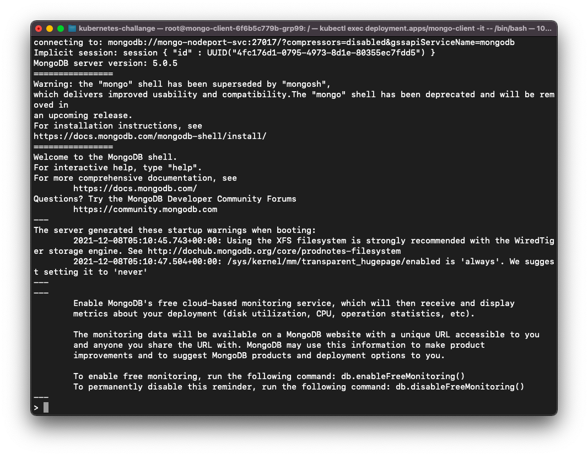
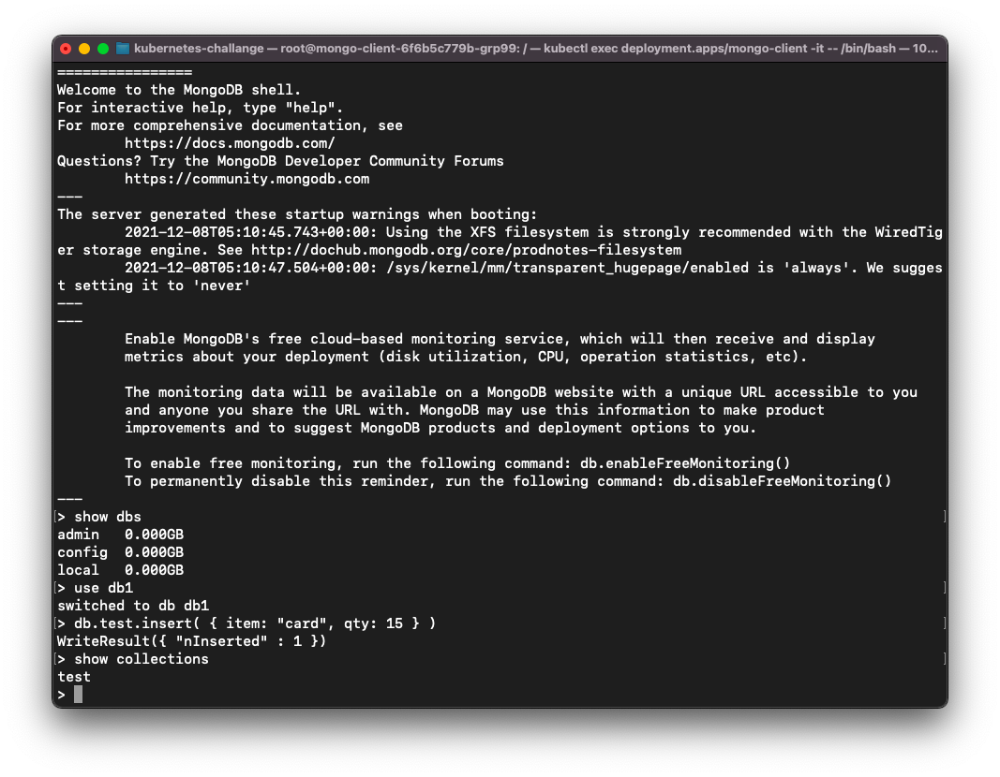

# Deploy MongoDB Cluster on Kubernetes
## _Deploy MongoDB Cluster on DigitalOcean Kubernetes_

[](https://www.digitalocean.com/?refcode=0eeab663047a&utm_campaign=Referral_Invite&utm_medium=Referral_Program&utm_source=badge)

You can easily deploy MongoDB highly scalabale cluster on DigitalOcean Kubernetes Platform.
Some prerequisites:
- Git installed on your system
- [kubectl](https://kubernetes.io/docs/tasks/tools/) commandline tool installed
- doctl setup for smooth integration ( [How to install and setup doctl ?](https://docs.digitalocean.com/reference/doctl/how-to/install/) )

## Getting Started
In this guide you will get to know how to deploy NoSQL(MongoDB) Cluster on DigitalOcean Kubernetes (DOKS).
First Signup to DigitalOcean if you havn't already. Signup with the above button to get joining free $100 credit to your account.

> Deployment Video guide [HERE](https://youtu.be/V5-0bJXTq4E)

In the dashboard go to kubernetes section.

Select create new cluster

Fill out the form and your cluster will be setup within few minuites.



This is it. It is so simple to create a kubernetes cluster in DigitalOcean. Now we will setup mongoDB in our cluster.

## Deploying MongoDB
Open Terminal in your system and then follow the steps

```sh
git clone https://github.com/arpan45/mongodb-cluster-kubernetes.git
cd mongodb-cluster-kubernetes
```
You must have kubectl installed in your system


You can change the number of replicas and other setup in mongodb-deployment.yaml file.
```sh
apiVersion: apps/v1
kind: Deployment
metadata:
  labels:
    app: mongo
  name: mongo
spec:
  replicas: 1
  selector:
    matchLabels:
      app: mongo
  strategy: {}
  template:
    metadata:
      labels:
        app: mongo
    spec:
      containers:
      - image: mongo
        name: mongo
        args: ["--dbpath","/data/db"]
        livenessProbe:
          exec:
            command:
              - mongo
              - --disableImplicitSessions
              - --eval
              - "db.adminCommand('ping')"
          initialDelaySeconds: 30
          periodSeconds: 10
          timeoutSeconds: 5
          successThreshold: 1
          failureThreshold: 6
        readinessProbe:
          exec:
            command:
              - mongo
              - --disableImplicitSessions
              - --eval
              - "db.adminCommand('ping')"
          initialDelaySeconds: 30
          periodSeconds: 10
          timeoutSeconds: 5
          successThreshold: 1
          failureThreshold: 6
        env:
        - name: MONGO_INITDB_ROOT_USERNAME
          valueFrom:
            secretKeyRef:
              name: mongo-creds
              key: username
        - name: MONGO_INITDB_ROOT_PASSWORD
          valueFrom:
            secretKeyRef:
              name: mongo-creds
              key: password
        volumeMounts:
        - name: "mongo-data-dir"
          mountPath: "/data/db"
      volumes:
      - name: "mongo-data-dir"
        persistentVolumeClaim:
          claimName: "mongo-data"

```
Once your are in the folder, Enter the following commands in the terminal...

```sh
kubectl apply -f .
```

You will get something like this:

So deployments, persistant volumes and all the services are deployed.

Then to see everything up and running. enter the following command in terminal.[Optional]
```sh
kubectl get all
```

We can see that our mongoDB cluster is now setup and working correctly. Now we enter the bash shell of our mongo-client

```sh
kubectl exec deployment/mongo-client -it -- /bin/bash
```

Now we can access our mongo shell via noodeport

> Note: Make sure you have changed the username and password in the 'mongodb-secrets.yaml' file.

```sh
mongo --host mongo-nodeport-svc --port 27017 -u arpan -p arpan
```


Yee ! We have successfully logged in to our mongo shell. We can test everything is working by inserting a document in a collection.


## License

MIT

## Credits
https://devopscube.com/deploy-mongodb-kubernetes/